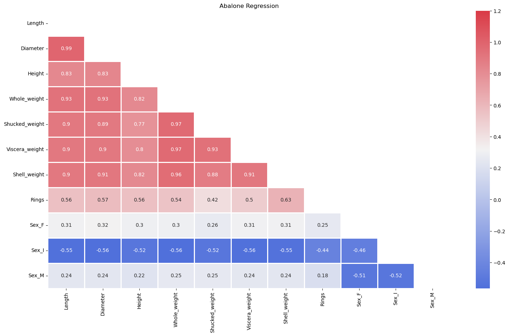
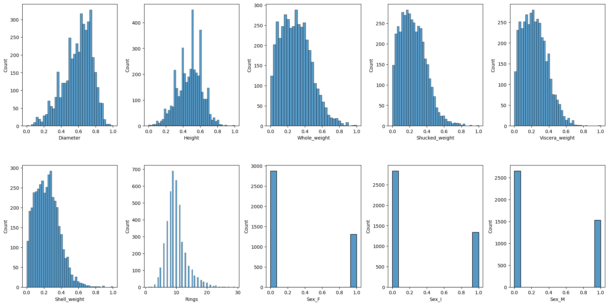

# ML-CW1 

**Group Number:** C4_18

**Group Members:** 

- Juntian Xiao
- Luqi Xin
- Guangzheng Dong
- Yuhong Yuan
- Qifeng He

# 1. Introduction

- **Classification Dataset** : [Wine Quality - UCI Machine Learning Repository](https://archive.ics.uci.edu/dataset/186/wine+quality) 
  - Two datasets are included, related to red and white vinho verde wine samples, from the north of Portugal. The goal is to model wine quality based on physicochemical tests (see [Cortez et al., 2009], http://www3.dsi.uminho.pt/pcortez/wine/).
  - The data description suggests that an anomaly detection algorithm can be used to identify a small number of good or bad wines. Also, it is not possible to determine whether all input variables are related. Therefore, special attention needs to be paid to the   processing of data.

- **Regression Dataset**:  [Abalone - UCI Machine Learning Repository](https://archive.ics.uci.edu/dataset/1/abalone)
  - Predict the age of abalone from physical measurements
  - The data description has indicated that the default values have been removed and the data scaling is reasonable. Therefore, it is more convenient in the display and use of data, and it is easy to apply the verification of the model.

# 2. Method Description
- **Model**
  
  - ***Linear regression***
  - ***Logistic regression***
  - ***Support vector machines (SVM)***
  - ***Decision trees***
  - ***Multilayer perceptron neural network***
  
- **Evaluate**
  
  - ***K-fold cross-validation***
  - ***Mean squared error (MSE) for Regression***
  
  

## 2.1 Analyzing Data

### Wine Quality

There are 11 features and 1 target value in this dataset, including: - `Fixed Acidity` - `Volatile Acidity` - `Citric Acid` - `Residual Sugar` - `Chlorides` - `Free Sulfur Dioxide` - `Total Sulfur Dioxide` - `Density` - `pH` - `Sulphates` - `Alcohol` The target value is: - `Quality` .

- Looking at the correlation matrix, it is evident that `Fixed Acidity` and `pH` are inversely correlated, as expected due to the relationship between acidity and pH levels. 

- When summing up `Free Sulfur Dioxide` and `Bound Sulfur Dioxide` (derived from `Total Sulfur Dioxide` minus `Free Sulfur Dioxide`), it corresponds closely to `Total Sulfur Dioxide`. 
- Some obvious outliers exist, such as extremely high values in `Residual Sugar` and `Chlorides`, which might indicate wines with significantly different processing or contamination.

### Abalone

There are 8 features and 1 target value in this dataset, including `'Sex', 'Length', 'Diameter', 'Height', 'Whole_weight', 'Shucked_weight', 'Viscera_weight', 'Shell_weight',` and target value `'Rings'`

- Looking at graph it is evident that Length and Diameter are highly correlated.

- when summing up `'Shucked_weight', 'Viscera_weight', 'Shell_weight'`  it is quite close to `Whole_weight`.

- Some obvious outliers exist like 0 value and huge value in `Height` .

## 2.2 Data Preprocessing

### Wine Quality

#### Scaling

Given that features like `fixed acidity`, `volatile acidity`, `residual sugar`, and `alcohol` have different ranges, standard scaling can help normalize these variations.

#### Outliers

By analyzing the graph of scaled features, we applied the `winsorize()` function to trim some extreme values, making the scaled data balanced.

### Abalone

- Looking at graph we found that `'Length'` and `'Diameter'` are highly correlated, since decided to remove 'Length'. 

- Feature `'Sex'` is a string type, in order to fit it into regression model, it should be applied One-Hot-Encoding.
- We applied IQR Method to other features that also have outliers.
- Then using min-max-scaler to scale this dataset. We eventually obtained a relatively balanced dataset.

# 3. Parameters settings
## 3.1 Wine Quality

### 3.1.1 Random Forest Classifier           ( **Change to Decision trees !!!**)

**parameters**:  **min_samples_split**=5, **n_estimators**=200, **random_state**=42

- **min_sample_split:** By increasing this parameter, we have reduced the total number of splits, thereby limiting the number of parameters in the model and reducing overfitting.

- **n_estimators:** Given the limited size of our dataset, increasing this parameter could result in a more generalized model.

### 3.1.2 Logistic regression

### 3.1.3 Support vector machines (SVM)

**parameters**: kernel='rbf', gamma='scale', degree=3, C=10, random_state=0

- **C**: By increasing C from 1 to 10, we improved model’s accuracy, which indicates that the SVM model is less tolerant of misclassifications and is better able to fit the training data closely. 

### 3.1.4 Multilayer perceptron neural network

## 3.2 Abalone

### 3.2.1 Decision trees 

### 3.2.2 Linear regression

### 3.2.3 Support vector machines (SVM)

**parameters**: kernel='rbf', gamma='scale', C=100, epsilon=0.5

- **epsilon**: By increasing epsilon value, we increased tolerance for error, making the model more robust and reducing the risk of overfitting to small errors.

### 3.2.4 Multilayer perceptron neural network
**parameters**:  **hidden_layer_sizes=(64, 32, 16, 8)**, **epoch=450**, **learning_rate_init=0.005**,  **batch_size=80**
- **Hidden Layer Size**: Starting with 64 neurons captures broad features, and decreasing the number in deeper layers helps refine them. This is of benefit to
  balance model capacity and reducing the risk of overfitting.
- **Learning Rate**: A low learning rate of 0.001 caused the model to get trapped in a suboptimal local minimum, while increasing the learning rate to 0.01 led to
  premature fluctuations in the model's metrics which indicated overfitting. Setting the learning rate to 0.005 resolved these issues.
- **Batch Size**: A batch size of 80 can provide a stable estimate of the gradient and avoid overfitting.
- **Epochs**: After adjusting the epoch several times, we settled on 450 epochs which can not only effectively reduce the model's MSE but also maintain stability
  without significant fluctuations. 

# 4. Assessment

#### **Logistic Regression Model**

After performing proper data normalization and selecting optimal hyperparameters, we found that the performance remains difficult to compare with three other models.

There are several reasons for this. Based on the principles of Logistic Regression, features should be linearly related to the target value. However, by analyzing the correlation of each feature with quality, it is evident that customers tend to choose specific ranges of parameters such as 'alcohol', 'residual sugar', 'total SO2', and so on. It turns out that the combination of specific range of wine parameters is crucial.

**Linear regression**

**Decision trees** 

**Support vector machines (SVM)**

**Multilayer perceptron neural network**

# 5. Conclusion
